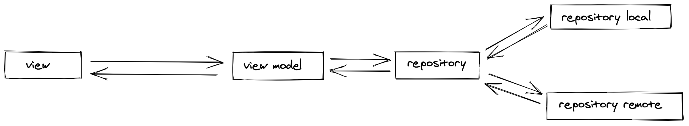
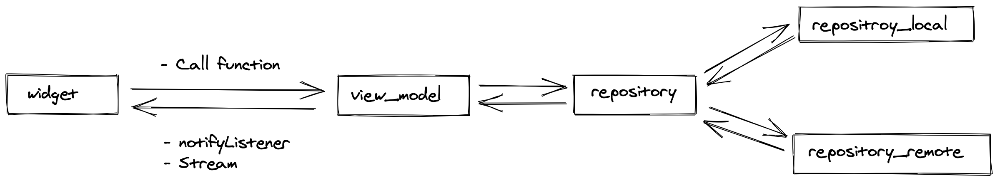

# mvvm_example

Flutter MVVM Architecture example project.

## MVVM

**This project MVVM**

## Demo

## Dependencies

Very simple.

- [provider](https://pub.dev/packages/provider)
    - State management in View Model.
    - Data binding by View Model.
- [Stream](https://api.flutter.dev/flutter/dart-async/Stream-class.html)
    - Event notification by View Model.

## Author

yasukotelin